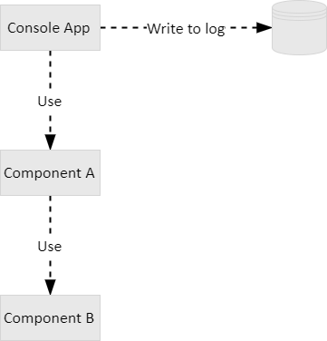

# MessageBroadcasting 1.0.0

## What is it?

`MessageBroadcasting` is a NuGet package written in C# to provide a framework for, well, message broadcasting among a set of components in any application.

## What do you mean by "message broadcasting"?

Let's say we have an application which has two libraries and one console app. We want to log the messages generated throughout the logic of the application, so this is the first approach that comes to mind. We will call it the "open bar approach".


The problem with this approach is that you need to add the same logging capabilities to each and every one of the components in your app (let's say NLog, for example). That's not nice.

What if we want to save the log messages just from the console app? We well call it the "one app to rule them all approach".



Well, certainly we don't have to add logging capabilities to components A and B, but we will have logging activity just from the console app itself, condemning the satellite components to oblivion.

Ok, let's have a final try. What about a system where each component is able to send log messages to other components which, in turn, will eventually be sending the messages all the way back to the console app, which will be the only one with logging capabilities?


This is what we are talking about when we say "message broadcasting": a framework in which a component is able to send messages to any other subscribing component, keeping the architecture neat and clean. Notice how the console app knows about component A, but knows nothing about component B. Thus, component A is subscribed to messages from component B, and the console app is subscribed to messages from component A (which may forward messages from component B, of course).

## Roles

This library enables three different roles for any component:

* **Sender**: A sender is a component which is able to send messages to any subscriber, regardless there are any or not.
* **Receiver**: A receiver is a component which subscribes itself to the messages sent by one or more receivers, regardless they send messages or not.
* **Relay**: A relay is both a sender and a receiver at the same time. You have just met one relay, component A, which not only is able to send messages of its own, but also to resend messages from component B.

## How to use it

This library provides two elements for each role: and interface and an abstract class. The most straightforward option is using the abstract class as a base class for our own classes, but that's not always possible (or desirable), so we well show the two alternatives for each role.

### Creating a sender

A sender can just be created just by extending the abstract base class `MessageSender`:

```C#
public class MySender : MessageSender { ... }
```

Using the abstract base class will rule out the possibility to inherit from another class. For example, let's say we have a class `DatabaseConnection` which has a child class `OracleConnection`. You could not do this then:

```C#
public class OracleConnection : DatabaseConnection, MessageSender {
    // Your code goes here.
}
```

In such cases, you will have to implement the interface `IMessageSender`, which is the contract that every sender should stick to. This interface declares two operations and an event handler:

* `MessageSentEvent`: Event used to send messages.
* `SendMessage (int messageLevel, string messageText)`: Function used to broadcast a text message with a certain level of importance (see class `MessageLevel`).
* `SendMessage (int messageLevel, string messageText, Exception exceptionThrown)`: Function used to broadcast tied to an exception with a certain level of importance.

Just copy the functions from `MessageSender` base abstract class and you are good to go.

This is the way to broadcast a message from a sender.

```C#
var sender = new MySender ( );

sender.SendMessage (MessageLevel.INFO, "This is an informational message.");
sender.SendMessage (MessageLevel.ERROR, "This is an error message tied to an exception.", new UnauthorizedAccessException ( ));
```

### Creating a receiver

Much like the sender, the receiver can be created just by extending the abstract base class `MessageReveiver`, like this:

```C#
public class MyReceiver : MessageReceiver { ... }
```

Again, you might not be able to extend your class, so you will have to implement yourself the interface `IMessageReceiver`. These are the functions you need to fill in:

* `void SubscribeToMessagesFrom (IMessageSender sender)`: Function to subscribe the receiver to the messages broadcast by a specific sender.
* `void UnsubscribeToMessagesFrom (IMessageSender sender)`: Function to unsubscribe the receiver to the messages broadcast by a specific sender.
* `void OnMessageSent (IMessageSender sender, Message message)`: Event handler which defines what needs to be done when a message from a specific sender is received.
* `void Dispose ( )`: The interface `IMessageReceiver` implements in turn the interface `IDisposable`, so you will need to implement the aforementioned function to get rid of the open subscriptions you may have when destroying the object.

Take into account that even when you inherit from the abstract base class `MessageReceiver`, you will need to implement the function `OnMessageSent ( )` on your own because the abstract base class knows nothing about what you intend to do with the received messages.

In order to use the receiver, that's what you need to do:

```C#
using (var receiver = new MyReceiver ( )) {
    receiver.SubscribeMessagesFrom (sender)
}
```

What happens here depends pretty much on the specific implementation of the function `OnMessageReceived ( )`.

### Creating a relay

Remember that a relay is both a sender and a receiver at the same time. Again, you can just inherit from the abstract base class `MessageRelay` to create your own relay:

```C#
public class MyRelay : MessageRelay { ... }
```

However, you can implement the interface `IMessageRelay`, which not only declares all the functions from the sender and receiver point of view, but also declares a function `void ForwardMessage (IMessageSender sender, Message message)` which will control what happens when you want to forward a message received from the sender in the role of receiver.